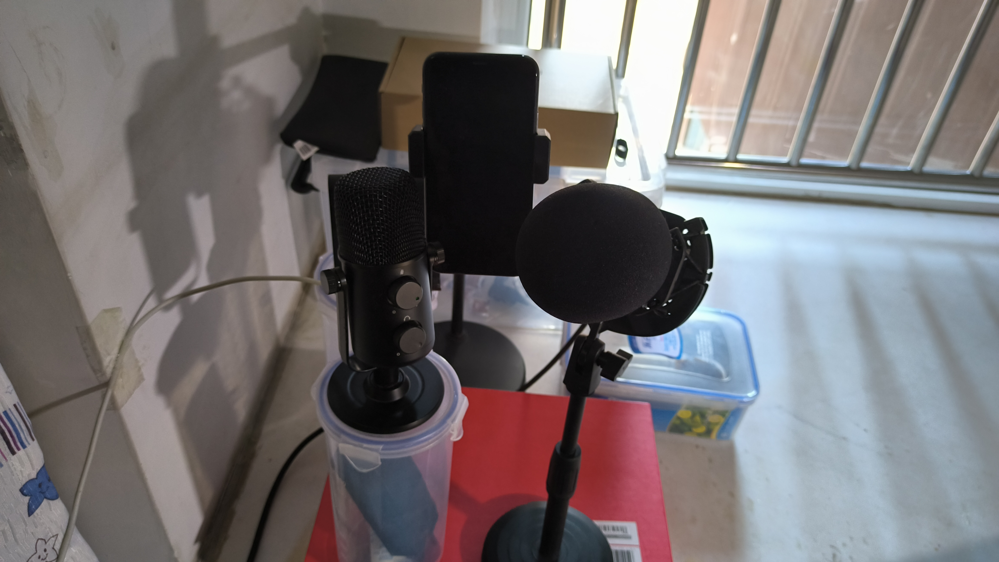
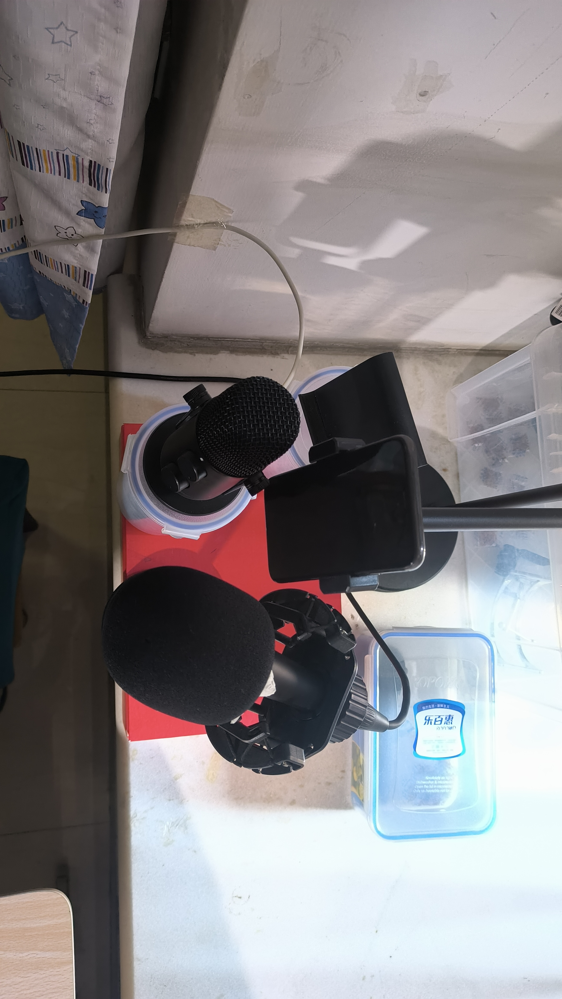

# XK口型数据集

### 数据概述
本数据集总时长约35分钟，在没有声学装修的安静房间录制，使用 **LipsSync** 获取口型数据。音频未经过处理，在实际使用时可根据需求进行对齐或降噪操作。

### 录制环境与设备信息
- **录制环境**：安静的房间（无声学装修）
- **录制设备**：
  - iPhone X
  - 红米 Note 11T Pro
  - SM57 动圈麦克风
  - 杂牌电容麦克风

> **注意**：由于 iPhone X 性能限制，部分较长的歌曲需分多次录制完成。

## 歌曲列表

| 序号 | 时间戳       | 歌曲名称               | 歌手/演唱者        |
|------|--------------|------------------------|--------------------|
| 1    | 12-07-59     | 夜空中最亮的星         | 逃跑计划           |
| 2    | 12-15-17     | 夜空中最亮的星         | 逃跑计划           |
| 3    | 12-53-10     | 远辰落身旁             | 谢春花             |
| 4    | 13-01-17     | 深夜诗人               | ilem              |
| 5    | 13-05-19     | 深夜诗人               | ilem              |
| 6    | 13-10-13     | 勾指起誓               | ilem              |
| 7    | 13-29-06     | 让我们荡起双桨         | 刘慧芳             |
| 8    | 13-33-08     | 一直很安静             | 阿桑               |
| 9    | 13-38-22     | 我是小冰               | 小冰               |
| 10   | 13-45-08     | 我多想说再见啊         | 柯立可             |
| 11   | 13-48-40     | 我多想说再见啊         | 柯立可             |
| 12   | 13-56-48     | 远辰落身旁             | 谢春花             |
| 13   | 14-06-00     | 情花                   | 本兮               |
| 14   | 14-11-42     | 你曾是少年             | S.H.E              |
| 15   | 14-16-17     | 你曾是少年             | S.H.E              |
| 16   | 14-20-34     | 你曾是少年             | S.H.E              |
| 17   | 15-17-39     | 飞云之下               | 韩红 & 林俊杰      |
| 18   | 15-22-00     | 飞云之下               | 韩红 & 林俊杰      |
| 19   | 15-28-51     | 童话                   | 光良               |
| 20   | 15-32-03     | 童话                   | 光良               |
| 21   | 15-39-01     | 溺爱                   | 本兮               |
| 22   | 15-43-08     | 溺爱                   | 本兮               |
| 23   | 15-47-43     | 你的答案               | 阿冗               |
| 24   | 15-52-32     | 现在开始               | 本兮               |
| 25   | 15-59-30     | 告诉自己忘了他         | 本兮               |
| 26   | 16-03-41     | 青花                   | 周传雄             |
| 27   | 16-07-07     | 洋娃娃和小熊跳舞       | 姆卡楚尔宾娜       |
| 28   | 16-10-02     | 女孩你为何踮脚尖       | 秦楼凤吹           |
| 29   | 16-15-44     | 有心无意              | 本兮               |
| 30   | 16-22-07     | 只想唱这首歌给你听     | 本兮               |

---

## 图片展示

以下为录制设备及环境的照片：

> 描述：这是录制过程中使用的设备组合，红米 Note 11T Pro 在录制时放在电容麦的后面，这张图是它拍的所以照片里没有红米 Note 11T Pro。

